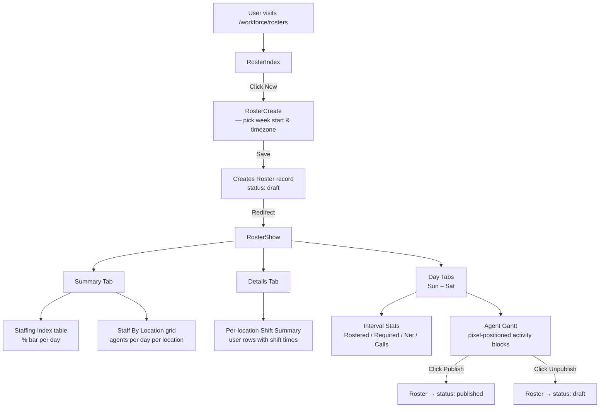
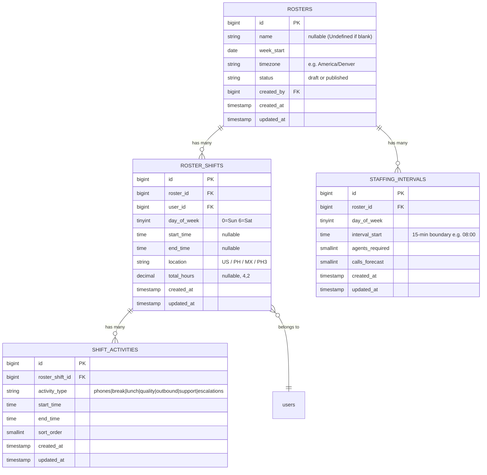
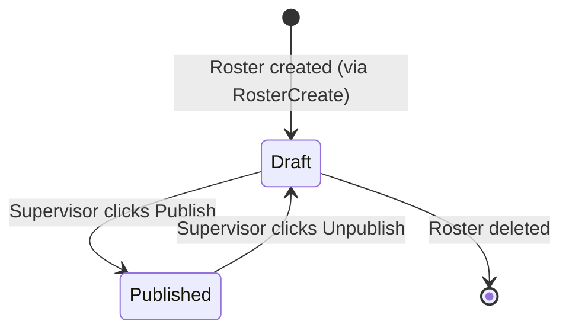

# Workforce Module

> Weekly roster management, shift scheduling, activity block planning, and staffing-level analysis.

---

## Overview

The Workforce module lets supervisors create and publish **weekly rosters**.  
Each roster covers **Sunday through Saturday** and contains:

- **Roster Shifts** — one record per user per day (start/end time, location, total hours).
- **Shift Activities** — ordered activity blocks within a shift (Phones, Break, Lunch, Quality, Outbound, Support, Escalations).
- **Staffing Intervals** — 15-minute interval targets (agents required, calls forecasted) used to compute the Staffing Index.

---

## Module Flow



---

## Data Model



---

## Roster Lifecycle



---

## Staffing Index Calculation

```
For each 15-minute interval I in a given day:

  phonesCount(I) = count of RosterShifts that have
                   a "phones" ShiftActivity covering interval I

  idx(I) = (phonesCount(I) / agents_required(I)) × 100

DayStaffingIndex = average of idx(I) across all intervals with data

UnderstaffedIntervals = count of I where phonesCount(I) < agents_required(I)

UnderstaffedAgents    = average gap (agents_required - phonesCount)
                        across understaffed intervals only
```

**Colour thresholds for the progress bar:**

| Staffing Index | Bar Colour |
|---|---|
| ≥ 95 % | Green |
| 85–94 % | Yellow-400 |
| 75–84 % | Yellow-500 |
| < 75 % | Pink-500 |

---

## Activity Type Colour Map

| Type | Tailwind bg | Hex |
|---|---|---|
| Phones | `bg-teal-500` | `#14b8a6` |
| Break | `bg-pink-500` | `#ec4899` |
| Lunch | `bg-yellow-500` | `#eab308` |
| Quality | `bg-fuchsia-600` | `#c026d3` |
| Outbound | `bg-sky-500` | `#0ea5e9` |
| Support | `bg-violet-600` | `#7c3aed` |
| Escalations | `bg-red-500` | `#ef4444` |

---

## File Inventory

### Migrations

| File | Purpose |
|---|---|
| `database/migrations/2026_04_01_000001_create_rosters_table.php` | `rosters` table |
| `database/migrations/2026_04_01_000002_create_roster_shifts_table.php` | `roster_shifts` table |
| `database/migrations/2026_04_01_000003_create_shift_activities_table.php` | `shift_activities` table |
| `database/migrations/2026_04_01_000004_create_staffing_intervals_table.php` | `staffing_intervals` table |

### Models

| File | Key features |
|---|---|
| `app/Models/Roster.php` | `week_end` accessor, `published()` scope, `forWeek()` scope |
| `app/Models/RosterShift.php` | `shift_label` accessor ("7:30am – 4:00pm") |
| `app/Models/ShiftActivity.php` | `COLORS` and `TYPES` constants, `color` accessor |
| `app/Models/StaffingInterval.php` | `agents_required` / `calls_forecast` integer casting |

### Livewire Components

| File | Responsibility |
|---|---|
| `app/Livewire/Workforce/RosterIndex.php` | Paginated roster list with search |
| `app/Livewire/Workforce/RosterCreate.php` | Create form → redirect to RosterShow |
| `app/Livewire/Workforce/RosterShow.php` | Summary / Details / Day tabs, Gantt computation, publish/unpublish |

### Blade Views

| File | What it renders |
|---|---|
| `resources/views/livewire/workforce/roster-index.blade.php` | Table list with status badge |
| `resources/views/livewire/workforce/roster-create.blade.php` | Name + week-start + timezone form |
| `resources/views/livewire/workforce/roster-show.blade.php` | Tabbed interface with Staffing Index, Details, Gantt |

---

## API / Actions

| Method (Livewire) | Description |
|---|---|
| `RosterIndex::updatingSearch()` | Resets pagination on search change |
| `RosterCreate::save()` | Validates, creates Roster, redirects |
| `RosterShow::setTab(string)` | Switches active tab (summary / details) |
| `RosterShow::setDay(int)` | Switches to the day Gantt tab |
| `RosterShow::publish()` | Sets `status = published` |
| `RosterShow::unpublish()` | Sets `status = draft` |

---

## Routes

```
GET /workforce/rosters              → Workforce\RosterIndex       (workforce.rosters.index)
GET /workforce/roster/create        → Workforce\RosterCreate      (workforce.roster.create)
GET /workforce/roster/{roster}      → Workforce\RosterShow        (workforce.roster.show)
```

All routes are inside `auth` + `campaign.selected` middleware.

---

## Local Setup

```bash
# Run new migrations
php artisan migrate

# Confirm tables
php artisan tinker --execute="collect(Schema::getTableListing())->filter(fn(\$t)=>str_contains(\$t,'roster'))->each(fn(\$t)=>dump(\$t));"

# Seed a test roster (tinker)
App\Models\Roster::create([
    'name'       => 'Test Week',
    'week_start' => '2026-03-29',
    'timezone'   => 'America/Denver',
    'status'     => 'draft',
    'created_by' => 1,
]);
```

Then open `http://your-app.test/workforce/rosters`.

---

## Roadmap

### Phase 2 (Hardening)
- Inline shift editing — click an activity block to open an edit modal.
- Shift block drag-and-drop using `AlpineJS` + sortable.
- CSV import for `staffing_intervals` (agents_required + calls_forecast per 15-min slot).
- Role permissions: `workforce.view`, `workforce.manage`.

### Phase 3 (Advanced)
- Link real call data from Twilio into `staffing_intervals.calls_forecast`.
- Auto-predict staffing levels from historical call volume.
- Integrate Twilio TaskRouter for real-time agent-to-queue matching.
